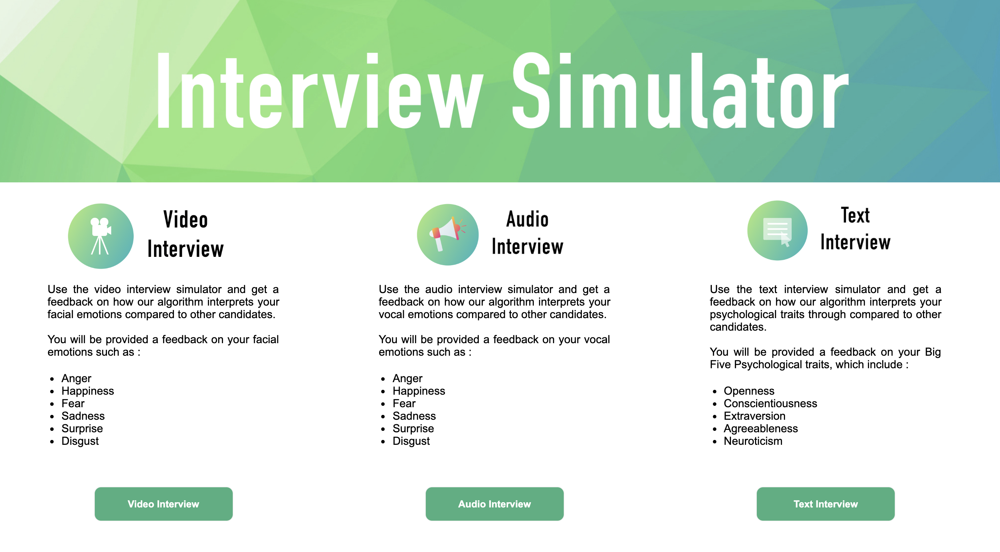

# Audio Sentiment Analysis Application

We analye vocal emotions, using mostly deep learning based approaches. We deployed the web app using Flask

## How to use it ?

To use the web app :
- Clone the project locally
- Go in the folder of repo
- Run `$ pip install -r requirements.txt``
- Launch the app by running `python main.py`
- You can also use "set FLASK_APP=main.py" and then use "flask run"
- Go to http://127.0.0.1:5000/ (or follow the link given in your terminal)

## How does it work ?

As stated in the project home page, we have defined and trained deep learning models to analyze emotions and psychological traits from audio inputs.
The user should be able to record his oral answer in the form of an audio and get a feedback on his performance compared to other people who already took the test.

## Getting the feedback

A button will directly allow you to get feedback. A dashboard displays your performance compared to other candidates.

## Organization

The organization of the project is the following :

- Models : All the pre-trained models used by the application
- library : The Python scripts that run the emotion detection algorithms
- static :
  - CSS : The CSS style sheet and fixed images to display
  - JS : The JavaScript of the app (D3.js) and the databases that store the information
- templates : All the HTML pages of the project
- tmp : Temporary files (i.e. the recorded audio file)
- main.py : The Flask page that calls the functions and redirects to HTML files
